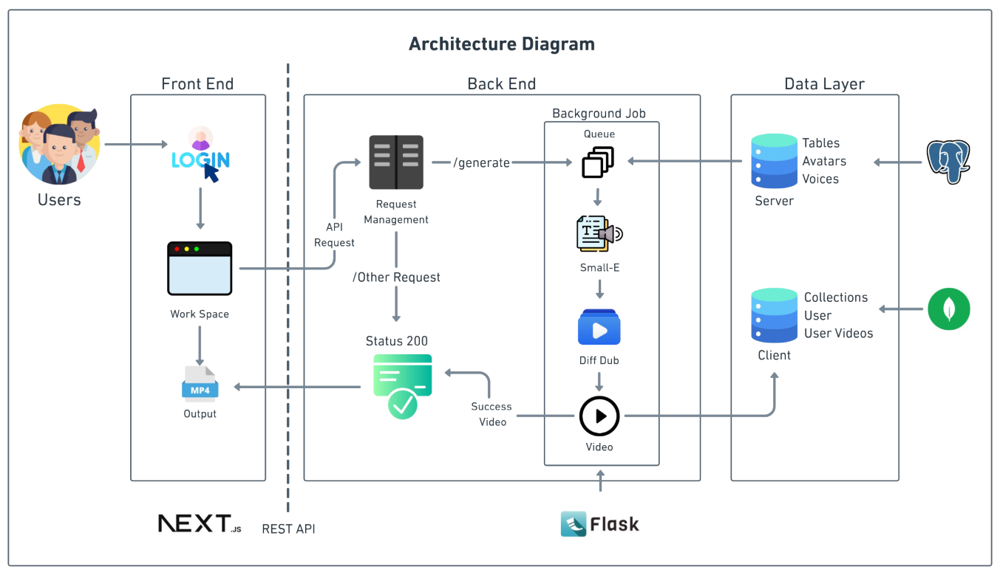

 <h1> Avatar Lab: Text-to-Avatar Speech Synthesis </h1> 

# 🚀 Introduction:
Imagine typing a script and watching a lifelike digital avatar bring it to life — speaking your text with natural expressions,
synchronized lip movements, and realistic voice modulation.
Welcome to Avatar Lab, where we merge the power of AI, deep learning, and speech synthesis to create real-time talking avatars.

# Purpose of the Project:
The purpose of Avatar Lab is to build an end-to-end deep learning pipeline capable of converting textual input into realistic talking head videos. This is achieved by integrating a powerful text-to-speech model (SMALL-E) with a facial animation model (DiffDub).
Our key focus is to enable seamless avatar generation that can be used in various domains like:

* Virtual Assistants 🚀

* Education/Online Learning 🎓

* Gaming Industry (NPC Speech) 🎮

* Digital Storytelling/Media Production 🎬

* Customer Support Automation 💬

# 🎨 Architecture Diagram:
The overall architecture of our project is designed to efficiently convert text into talking avatar videos.

# 🛠 Workflow Diagram:

The workflow of the project can be visualized as follows:

# 📜 Reference Research Papers:

## SMALL-E: Efficient Text-to-Speech Model
### Objective :
Develop an efficient TTS model for natural speech and zero-shot cloning on limited hardware, using linear attention instead of quadratic transformers.
### Key Innovations:
### 1.Linear Causal Language Model (LCLM) Blocks :
  Replace decoder-only transformers with recurrent architectures (GLA, RWKV, Mamba) for efficient training on long sequences (up to 30s) with lower cost.

### 2.Position-Aware Cross-Attention (PACA):
  Introduce modified cross-attention with positional feedback to prevent TTS issues like skipping and repetition by improving text-audio alignment.

### 3.Conditional Codec Language Modeling:
 Model TTS as language modeling over RVQ audio tokens for zero-shot voice cloning without a separate speaker encoder.

### Method Pipeline:
### Text & Audio Compression: 
    Text is processed with byte-pair encoding and a non-causal transformer encoder.Audio is compressed using an RVQ codec and then encoded with a stack of LCLM blocks.
### Integration via Cross-Attention:
    The Position-Aware Cross-Attention mechanism fuses text and audio embeddings.Uses sinusoidal positional embeddings and a recurrent feedback loop to maintain accurate alignment.
### Audio Decoding:
    An audio decoder (mirroring the encoder architecture) reconstructs audio tokens from the fused embeddings, outputting logits for final token prediction.

### Results & Comparisons:
Small-E trains faster, reduces errors, and sounds better than other models like YourTTS but not as good as MetaVoice.

### Limitations & Future Work:
Model Scale: Efficient with 64M parameters but trades off some performance.
Future: Improve linear attention and explore streaming TTS for better quality and embedded use.

### 📁 Model References:
- [SMALL-E GitHub Page](https://github.com/theodorblackbird/lina-speech)
- [SMALL-E Research papers](https://arxiv.org/pdf/2406.04467)

## DiffDub: Diffusion-based Lip Sync Model
### Objective:
DiffDub is a diffusion-based model designed to generate accurate lip-sync animation from any audio input.
### Why We Switched to DiffDub:
Initially, we planned to use DiffTalk, but we later realized that DiffDub provides:
✅ Higher lip-sync accuracy.

✅ Better performance on low-latency video generation.

✅ Easier model integration.

### Key Features:
Generates realistic facial movements and expressions.

Low latency inference suitable for real-time generation.

High-quality video outputs.

### 📁 Model References:
- [Diffdub Github Page](https://github.com/liutaocode/DiffDub)
- [Diffdub Research Paper](https://arxiv.org/pdf/2311.01811)

# 👥 Contributors

| Contributor Name | First Milestone PPT | First Milestone Video | Second Milestone PPT | Second Milestone Video |
|------------------|--------------------|-----------------------|----------------------|------------------------|
| P HRITHIK RAJ | [PPT](assests/presentations/mileStone-1/HRITHIK/✨AI%20·%20AI%20Avatars_%20Transforming%20Text%20to%20Video.pdf) | [Video](https://youtu.be/-5II5I0m4bY) | [PPT](assests/presentations/mileStone-2/HRITHIK/Avatar-Lab-Final-Presentation.pdf) | [Video](https://youtu.be/cqQ-ZUpZ1sQ) |
| A YASHWANTH | [PPT](assests/presentations/mileStone-1/YAsHWANTH/Avatar%20lab.pdf) | [Video](https://youtu.be/FT2L9GiezVY) | [PPT](assests/presentations/mileStone-2/YASHWANTH/AVATAR-LAB.pdf) | [Video](https://youtu.be/-QRKHvKZqNc?si=oiZKHnSNAHOMjJwF)|
| NIKHILESH NILAGIRI | [PPT](/assests/presentations/mileStone-1/NIKHILESH/nikhilesh_m1.pdf) | [Video](https://youtu.be/lFoVxP5mgVU) | [PPT](/assests/presentations/mileStone-2/NIKHILESH/nikhilesh_m2.pdf) | [Video]( https://youtu.be/Q-7GzEw8D5s) |
| N MAHESH | [PPT](/assests/presentations/mileStone-1/MAHESH/mahesh.pdf) | [Video](https://youtu.be/wXBeMU6vFlQ) | [PPT](/assests/presentations/mileStone-2/MAHESH/Avatar%20Lab%20ms2.pdf) | [Video](https://youtu.be/a1WBLwN1LWs?feature=shared) |
| V VISHAL RAJ | [PPT](/assests/presentations/mileStone-1/VISHAL%20RAJ/vishal%20m1.pdf) | [Video](https://www.youtube.com/watch?v=RifoTDsPQGs) | [PPT](/assests/presentations/mileStone-2/VISHAL%20RAJ/vishal%20m2.pdf) | [Video](https://youtu.be/YLtXlmWXxPE) |
| K PRASANA KUMAR | [PPT](/assests/presentations/mileStone-1/PRASANA/prasanna%20m1.pdf) | [Video](https://www.youtube.com/watch?v=FH7-hDgiRYQ) | [PPT](/assests/presentations/mileStone-2/PRASANA%20/prasanna%20m2.pdf) | [Video](https://www.youtube.com/watch?v=iKzjnD208Sk) |

# ✅ Future Enhancements
We plan to enhance Avatar Lab by:

✅ Complete deployment and optimize production environment.

✅ Integrating multi-lingual text-to-speech models.

✅ Improving real-time performance using CUDA acceleration.

✅ Finalize hosting platform based on cost and scale.

